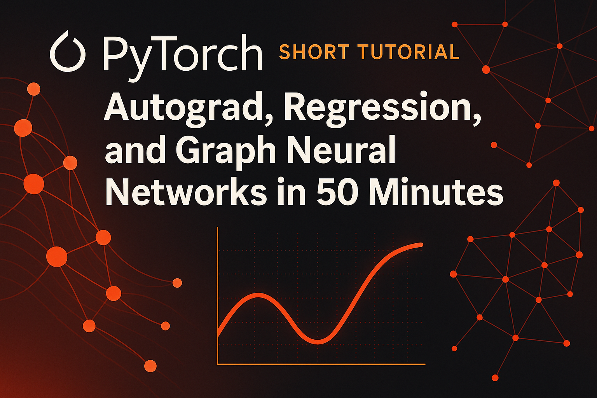

# Installation

## 1. 安裝 Python 3.11

請確保你的系統已安裝 Python 3.11。
macOS 可用 Homebrew 安裝：

```bash
brew install python@3.11
```

## 2. 安裝 uv

推薦使用 [uv](https://github.com/astral-sh/uv) 作為 Python 套件與虛擬環境管理工具。
安裝 uv（擇一）：

```bash
# 使用 Homebrew
brew install uv

# 或使用官方安裝腳本
curl -LsSf https://astral.sh/uv/install.sh | sh
```

## 3. 建立虛擬環境並安裝依賴

在專案根目錄下執行：

```bash
uv venv .venv --python=`which python3.11`
source .venv/bin/activate
uv pip install -r requirements.txt
```

這會自動建立 `.venv` 虛擬環境並安裝所有依賴。

## 4. 啟用虛擬環境

```bash
source .venv/bin/activate
```

---

# On-boarding

## 快速開始

1. **確認你已依照上方步驟完成 Python 3.11 與 uv 的安裝，並建立好虛擬環境與安裝依賴。**

2. **測試環境是否可用**

   你可以直接執行 `sessions/regression` 目錄下的範例：

   ```bash
   source .venv/bin/activate
   cd sessions/regression
   python main.py
   ```

   若能順利執行並看到結果，代表環境安裝成功。

3. **如遇到問題**

   - 請確認已啟用虛擬環境（.venv）。
   - 確認 requirements.txt 已完整安裝。
   - 若有權限或套件安裝問題，建議刪除 .venv 重新安裝。
   - 預期輸出:
   ```plaintext
   ❯ python3 main.py
    Epoch 1, Loss: 1338.2593
    Epoch 11, Loss: 186.8374
    Epoch 21, Loss: 137.0158
    Epoch 31, Loss: 40.6581
    Epoch 41, Loss: 100.5237
    Epoch 51, Loss: 70.9175
    Epoch 61, Loss: 58.4403
    Epoch 71, Loss: 29.0980
    Epoch 81, Loss: 26.5344
    Epoch 91, Loss: 18.0619
    Learned parameters:
    a, b, c, d, e = ['3.99', '-0.15', '-4.86', '1.96', '0.01']
    Ideal parameters:
    a, b, c, d, e = [4, 0, -6, 3, -0.2]
   ```


# Notes

- 本專案依賴 [PyTorch (CPU)](https://download.pytorch.org/whl/cpu) 及 [PyG (PyTorch Geometric)](https://pytorch-geometric.readthedocs.io/en/latest/install/installation.html) 等特殊源，詳見 `requirements.txt`。
- 請務必使用 uv 管理虛擬環境與套件，避免 pip/venv 混用造成依賴衝突。

如需更進階的 uv 用法，請參考 [uv 官方文件](https://github.com/astral-sh/uv)。
